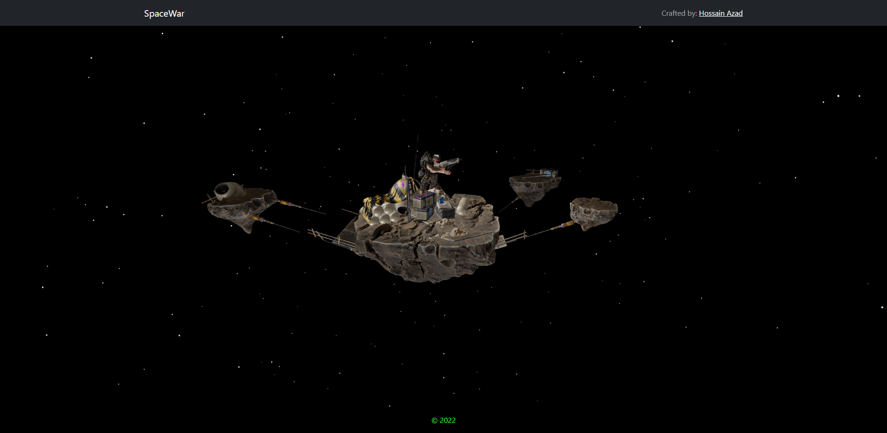

# Spacebrute
## _React & Three.js demonstration_

Simple GLTF model loaded into canvas using react-fiber and added simple physics and gesture control in it.



## Installation & Run

Requires [Node.js](https://nodejs.org/) v10+ to run.

Install the dependencies and devDependencies.

```sh
npm i
```

Simply run the project...

```sh
npm start
```
